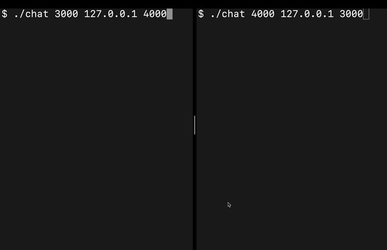

# Chat

A simple UDP chat application that concurrently listens to standard inputs and a UDP socket.

To build it: `cc -o chat chat.c`

Usage: `chat SOURCE_PORT DESTINATION_ADDRESS DESTINATION_PORT`

`DESTINATION_ADDRESS` must be running `chat` with `SOURCE_PORT` = `DESTINATION_PORT` to recieve messages.

# Demo

